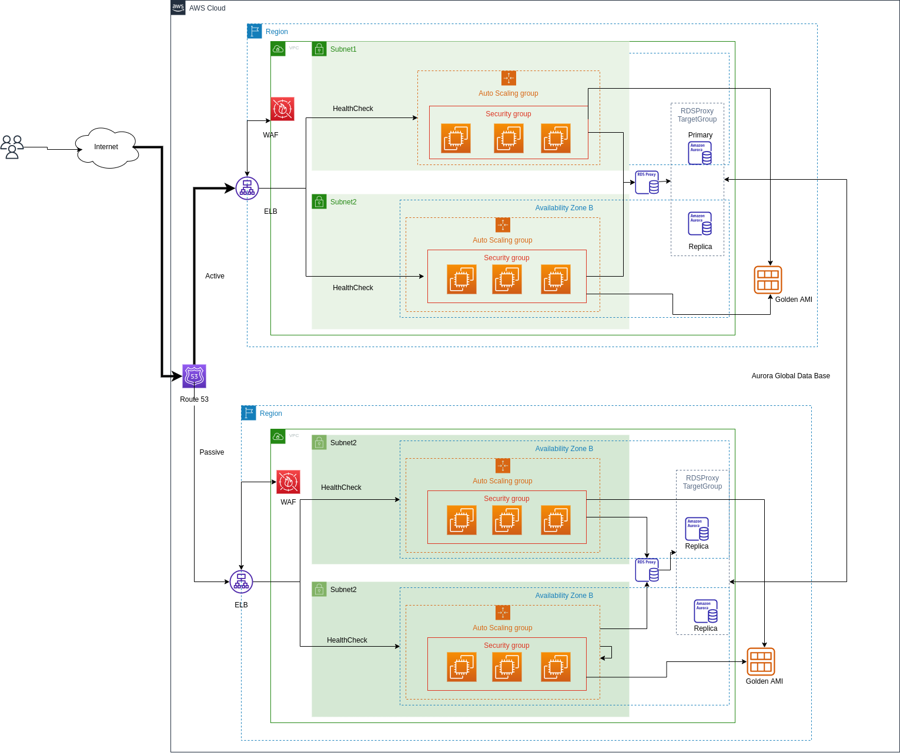

# exercise_lf

This resolucion from exercise form document [LFDevOpsExecise.pdf](media/LFDevOpsExercise.pdf)

## Problem 1  
### answer question 1
- architecture  

  

### answer question 2
- The architecture has 2 availability zones where requests will be centralized through a Load Balancer application, which will validate the node's health and forward all requests in the event of a crash of one of the instances.  

### answer question 3  
- The database cluster are linked through rds proxy which will have a database target, where it will promote the passive database from read to write automatically in case of inconsistencies in the write database in one of the zones availability.  

### answer question 4  
- For the implementation of a Disaster Recovery it is suggested to implement a 'Warm standby' architecture where the traffic between regions is supported from 'Route 53'. The architecture would be deployed and it would remain active with data replication at the 'RDS Aurora' level and for the uniform deployment, a golden AMI is used with the provisioning of dependencies from the deployment. For a disaster recovery from 'Route 53', the region's traffic is redirected through a health check configuration. where the infrastructure already has active ec2 machines and a replicated database. estimated recovery time 10 min.  

### answer question 5  
- To access the machines, a vpn connection is defined, in the VPN a bastion server will be exposed from where the server can be reached using an encrypted ssh connection and a pair of keys.

### answer question 6  
- For the secure connection on the administrators of the instances in the case of ec2, the access keys are defined in the creation of the instance, either an existing key or with the creation of a new key pair. For more accesses through other keys, they can be added to profiles with limited accesses.  
- To create a secure connection using ssh, you can ask the user to create a pair of RSA-type keys with a minimum length of 4096 (recommended), generating the pair of keys, we request to share the public key and it will be loaded about the predefined user.

### answer question 7
- To provide access to one of the databases, the database endpoint must be shared. for authentication you can define an IAM authentication

### answer question 8
- with a vpn connection, a bastion server is exposed where an ec2 instance is reached that has a role that can assume the reading of the database

### answer question 9
- From AWS a VPN connection is enabled using the 'Client VPN Endpoints' service, for the endpoint configuration the connections which are routed are defined, the client can have authentication by third parties or by certificate. Once the service is configured, the client is downloaded and the configuration file must be loaded. for Linux computers you can use the 'OpenVPN' agent.

## Problem 2

- For this point i create a IaC in Cloudformation and cluster ECS Fargatein the folder [deploy](deploy)